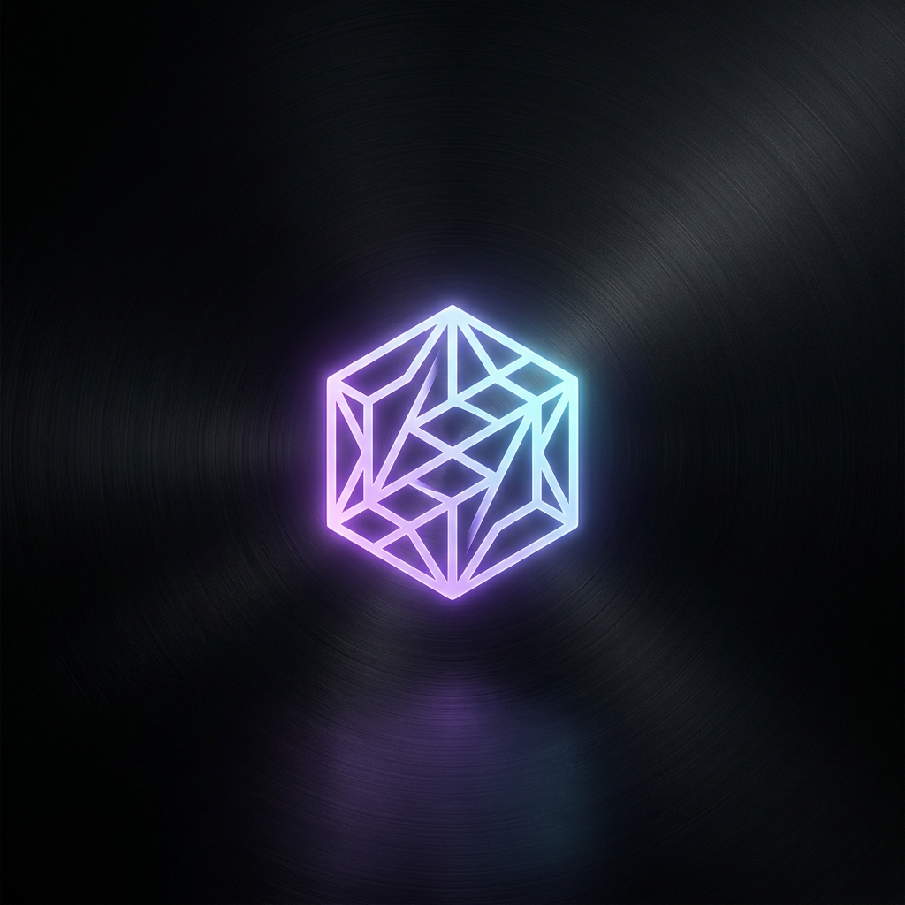

  

 

  

 

<table width="100%">
  <tr>
    <td width="50%" valign="top">
      <h3>✦ current focus ✦</h3>
      

        <code>></code> designing <b>scalable apis</b> 
        <code>></code> exploring <b>go & concurrency</b> 
        <code>></code> late nights <b>& complex databases</b>
      

      <h3>✦ currently learning ✦</h3>
      

        <code>></code> advanced <b>system design</b> 
        <code>></code> <b>docker & k8s</b> deployment 
        <code>></code> <b>cloud architectures</b>
      

    </td>
    <td width="50%" valign="top">
      <h3>✦ github stats ✦</h3>
      
    </td>
  </tr>
  <tr>
    <td width="50%" valign="top">
      <h3>✦ tech stack ✦</h3>
      
    </td>
    <td width="50%" valign="top">
      <h3>✦ activity ✦</h3>
      
    </td>
  </tr>
</table>

 

  <table width="100%">
    <tr>
      <td align="center">
        <h3>✦ connect with me ✦</h3>
        
        
        
      </td>
    </tr>
  </table>

 

  

